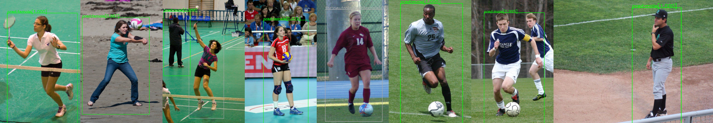

# Human Image Gender Classifier



This is the official repository of the Human Gender Classifier (Homogenus) used in the paper 

***Expressive Body Capture: 3D Hands, Face, and Body from a Single Image.***
	
Numerous methods have classified human gender using face images. In full-body images of a person, the face may be small or not visible.  Here we trained a classifier to analyze gender based on full-body images. The input to the classifier its a full-body human image and the 2D key points detected by OpenPose.  We use information about gender in our SMPLify-X code to select the appropriate 3D body model. Note that gender is non-binary — SMPLify-X has male, female, and neutral body models.  When the classifier is certain, we use the corresponding gendered model.  When it is uncertain, we use the neutral one. This codebase consists of the inference code. 

For further details on the method please refer to the following publication,

```
Expressive Body Capture: 3D Hands, Face, and Body from a Single Image
G. Pavlakos*, V. Choutas*, N. Ghorbani, T. Bolkart, A. A. A. Osman, D. Tzionas and M. J. Black 
Computer Vision and Pattern Recognition (CVPR) 2019, Long Beach, CA
```

A pdf preprint is also available on the [project page](https://smpl-x.is.tue.mpg.de/).


## Installation

The code uses Python 3.7 and is tested on tensorflow-gpu version 1.13.1, tensorboard==1.13.1, with CUDA-10.0 and cuDNN-7.5 running on Ubuntu 18.04.

### Setup homogenus Virtual Environment

```bash
venv_dir=~/.virtualenvs/homogenus
python3 -m venv $venv_dir --system-site-packages
source $venv_dir/bin/activate
```
### Clone the project and install requirements

```bash
git clone https://github.com/nghorbani/homogenus.git
cd homogenus
python setup.py install
```

## Download models

* Download pretrained homogenus weights from the [project website](https://smpl-x.is.tue.mpg.de), downloads page. 
Uncompress the weights in a folder, *e.g. by default homogenus/trained_models/tf* , and use the directory path in the following commands.

## Run Homogenus
After installation and obtaining the weights for the model, inside the virtual environment, 
you should be able to run the homogenus_infer command to get the help:

```bash
python3 -m homogenus.tf.homogenus_infer -h

usage: homogenus_infer.py [-h] [-tm TRAINED_MODEL_DIR] -ii IMAGES_INDIR -oi
                          OPENPOSE_INDIR [-io IMAGES_OUTDIR]
                          [-oo OPENPOSE_OUTDIR]

optional arguments:
  -h, --help            show this help message and exit
  -tm TRAINED_MODEL_DIR, --trained_model_dir TRAINED_MODEL_DIR
                        The path to the directory holding homogenus trained
                        models in TF.
  -ii IMAGES_INDIR, --images_indir IMAGES_INDIR
                        Directory of the input images.
  -oi OPENPOSE_INDIR, --openpose_indir OPENPOSE_INDIR
                        Directory of openpose keypoints, e.g. json files.
  -io IMAGES_OUTDIR, --images_outdir IMAGES_OUTDIR
                        Directory to put predicted gender overlays. If not
                        given, wont produce any overlays.
  -oo OPENPOSE_OUTDIR, --openpose_outdir OPENPOSE_OUTDIR
                        Directory to put the openpose gendered keypoints. If
                        not given, it will augment the original openpose json
                        files.

```
As an example, inside the homogenus folder you can run the following to get the gender predictions for the sample images and their corresponding openpose keypoints.
This command will print the predictions as well as creating new gendered openpose keypoints and gender overlayed images.  

```bash
python3 -m homogenus.tf.homogenus_infer -ii ./samples/images/ -io ./samples/images_gendered/ -oi ./samples/openpose_keypoints/ -oo ./samples/openpose_keypoints_gendered/
```
The headline image of this repository shows all these samples from the [LSP](http://dx.doi.org/10.5244/C.24.12) in-the-wild image dataset with overlayed genders for the [OpenPose](https://github.com/CMU-Perceptual-Computing-Lab/openpose) detected full-body humans.

## License

Free for non-commercial and scientific research purposes. By using this code, you acknowledge that you have read the license terms (https://smpl-x.is.tue.mpg.de/license), understand them, and agree to be bound by them. If you do not agree with these terms and conditions, you must not use the code. For commercial use please check the website (https://smpl-x.is.tue.mpg.de/license).

## Referencing Homogenus

Please cite the following paper if you use this code directly or indirectly in your research/projects.
```
@inproceedings{SMPL-X:2019,
  title = {Expressive Body Capture: 3D Hands, Face, and Body from a Single Image},
  author = {Pavlakos, Georgios and Choutas, Vasileios and Ghorbani, Nima and Bolkart, Timo and Osman, Ahmed A. A. and Tzionas, Dimitrios and Black, Michael J.},
  booktitle = {Proceedings IEEE Conf. on Computer Vision and Pattern Recognition (CVPR)},
  year = {2019}
}
```

## Contact
The code in this repository is developed by [Nima Ghorbani](https://ps.is.tuebingen.mpg.de/person/nghorbani).

If you have any questions you can contact us at [smplx@tuebingen.mpg.de](mailto:smplx@tuebingen.mpg.de).

For commercial licensing, contact [ps-licensing@tue.mpg.de](mailto:ps-licensing@tue.mpg.de)

## Acknowledgment
We thank [Pavel Karasik](mailto:pavel.karasik@student.uni-tuebingen.de) for helping in the dataset gathering and processing stage.